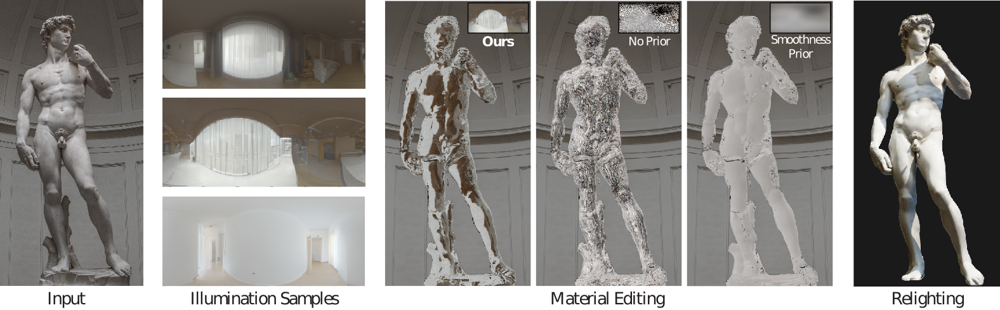

# Diffusion Posterior Illumination for Ambiguity-aware Inverse Rendering 

Official implementation of [Diffusion Posterior Illumination for Ambiguity-aware Inverse Rendering ](https://vcai.mpi-inf.mpg.de/projects/2023-DPE/).

ACM Transactions on Graphics (Proceedings of SIGGRAPH Asia), 2023

[Linjie Lyu](https://people.mpi-inf.mpg.de/~llyu/)<sup>1</sup>,
 [Ayush Tewari](https://ayushtewari.com/)<sup>2</sup>,
 [Marc Habermann](https://people.mpi-inf.mpg.de/~mhaberma/)<sup>1</sup>,
 [Shunsuke Saito](https://shunsukesaito.github.io/)<sup>3</sup>,
 [Michael Zollhöfer](https://zollhoefer.com/)<sup>3</sup>,
 [Thomas Leimkühler](https://people.mpi-inf.mpg.de/~tleimkue/)<sup>1</sup>,
 [Christian Theobalt](https://people.mpi-inf.mpg.de/~theobalt/)<sup>1</sup>
 
 
 <sup>1</sup>Max Planck Institute for Informatics,Saarland Informatics Campus , <sup>2</sup>MIT CSAIL,<sup>3</sup>Reality Labs Research
 


## Installation


```python
pip install -r requirements.txt
pip install torch==1.11.0+cu113 torchvision==0.12.0+cu113 torchaudio==0.11.0 --extra-index-url https://download.pytorch.org/whl/cu113
pip install mitsuba
```

## Data Preparation
See [hotdog](./data/hotdog) for references.

```
image/
    0.exr or .png
    1.exr or .png
    ...

scene.xml
camera.xml
```
## How to prepare your Mitsuba file?
**Geometry**

For real-world scenes, you can use a [neural SDF reconstruction](https://github.com/bennyguo/instant-nsr-pl) method to extract the mesh for Mitsuba xml file.

**Camera**

Some camera-reader code is provided in [camera](./data/camera). You can always load cameras to Blender and then export a camera.xml with the useful [Mitsuba Blender Add-on](https://github.com/mitsuba-renderer/mitsuba-blender).

## Training DDPM Model
```python
mkdir models
```
We use [Laval](http://www.hdrdb.com/) and [Streetlearn](https://sites.google.com/view/streetlearn/) as environment map datasets. Refer to [guided-diffusion](https://github.com/openai/guided-diffusion) for training details or download pre-trained [checkpoints](https://drive.google.com/drive/folders/1c0wtEafQN7ShzdfPbJaetCKv4h7_oSXs?usp=sharing) to ./models/. 

## Run Optimization
Here is an example to sample realistic outdoor environment maps take [hotdog](./data/hotdog) as input.

Environment Map Sampling:
```python
python sample_condition.py \
--model_config=configs/model_config_outdoor.yaml \
--diffusion_config=configs/diffusion_config.yaml \
--task_config=raytracing_config_outdoor.yaml;
```
Material Refinement:
```python
material_optimization.py --task_config=configs/raytracing_config_outdoor.yaml; 
```
## Differentiable Renderer Plug-in 

If you want to generate natural environment maps with another differentiable rendering method instead of Mitsuba3, it's easy. Just replace the rendering and update_material functions in ./guided_diffusion/measurements.py.

## Citation
```python
@article{lyu2023dpi,
title={Diffusion Posterior Illumination for Ambiguity-aware Inverse Rendering},
author={Lyu, Linjie and Tewari, Ayush and Habermann, Marc and Saito, Shunsuke and Zollh{\"o}fer, Michael and Leimk{\"u}ehler, Thomas and Theobalt, Christian},
journal={ACM Transactions on Graphics},
volume={42},
number={6},
year={2023}
}
```

